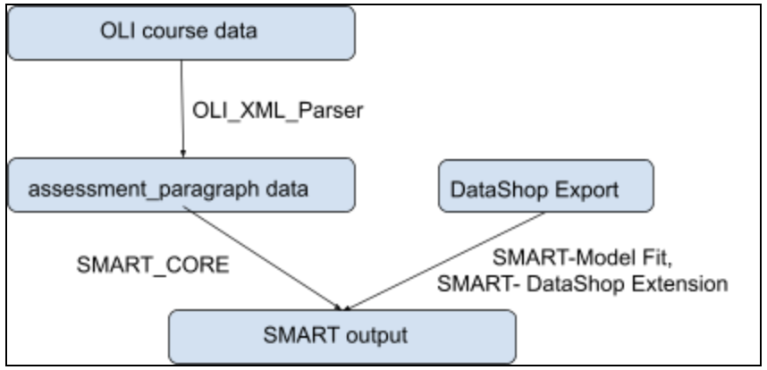

# SMART (Skill Model mining with Automated detection of Resemblance among Texts)

## Overview
The goal of this project is to extract a Skill Model from Massive Open Online Courses (MOOC) and to map a skill with each assessment item (question) as well as a text item (paragraph) in the course. Nowadays, there are a lot of MOOCs available for learners to consider and learn from. Therefore, it becomes very important to let the machines themselves learn important skills associated with each assessment item, without any supervision from the tutor. This application can be used to provide automatic feedback and hints to the learner of the course.

It is based on unsupervised learning technique. An input to the SMART application is the course content (instructional text and assessment items). SMART uses the text of these items to extract the skills and also names those skills. SMART tags the assessment items and instructional text with those skills. SMART can also associate each of the assessment items with the instructional text. 



## Table of Contents
  * [Overview](#overview)
  * [Installation (Ubuntu/Mac OS)](#installation--ubuntu-mac-os-)
  * [How to run?](#how-to-run-)
    + [Standalone (SMART_CORE)](#standalone---smart-core---smart-core--)
    + [As a hosted service (SMART_CyberBook)](#as-a-hosted-service---smart-cyberbook---smart-cyberbook--)
  * [Algorithms](#algorithms)
    + [Text embedding](#text-embedding)
    + [Text clustering](#text-clustering)
    + [Keyword extraction](#keyword-extraction)
  * [Evaluation](#evaluation)
  * [Major dependencies](#major-dependencies)
  * [Link to related documentations](#link-to-related-documentations)
  * [Acknowledgments](#acknowledgments)
  
## Installation (Ubuntu/Mac OS)
1. Clone this repository using the following command on the terminal:
    
   ` git clone https://github.ncsu.edu/nmatsud/PASTEL.git`

2. Install dependencies

    Note: Never modify the base environment. Always install the dependencies in a seperate conda/virtualenv environment. Please strictly ensure this when running on a lab computer. A conda environment called `smart` has already been set up on `Nerve` with all the prerequisites.

    CD to this folder (`PASTEL/SMART/`) and run the following command on the terminal to install the dependencies:
    ```
    pip install -r requirements.txt
    ```

## How to run?

Currently, SMART can be run in two ways. It can either fetch input generated from the [OLI_XML_Parser](OLI_XML_Parser), or it can fetch inputs from the Cyberbook database and update it back after running SMART.

### Standalone ([SMART_CORE](./SMART_CORE))

To run SMART_CORE, run the `run_smart.py` script using the following command on the terminal:
```
python run_smart.py
```

It can take following optional arguments:

`-strategyType <assessment/paragraph>`: (default = `assessment`)

`-encodingType <tf/tfidf/bert/s-bert>`: (default = `tfidf)`

`-representationType <first/second/hybrid>`: (default = `first`)

`-clusters <integer/'None'>`: specifies the number of clusters (k) to be formed by a sinngle run of k-means clustering. (default = 150, the code performs k-means clustering iteratively starting from k = input1*/2 and successively reducing it until the clusters with distinct skills are formed if the parameter is set to 'None')  
*input 1 = number of assessment texts if strategy type = assessment, otherwise number of paragraph texts.

`-outputFolder <string>`: specifies the path to the folder where the output is to be saved. (default = `'output'`)

`-course <oli_intro_bio/oli_gen_chem>`: specifies the OLI courseware to run SMART for. (default = `'oli_intro_bio'`)

`-merge <on/off>`: specifies whether or not to merge clusters with the same skill label. (default = `'off'`)

`-noClusterKeywordMapping`: a switch, skips saving cluster-keyword mapping to disk

`-noAssessmentSkillMapping`: a switch, skips saving assessment-keyword mapping to disk

`-noParagraphSkillMapping`: a switch, skips saving paragraph-keyword mapping to disk

To run the entire study (SMART-CORE + SMART-Model Fit), run the `run_study_n_times.sh` script using the following command on the terminal:
```
sh run_study_n_times.sh <output_folder>
```

`<output_folder>` is the path for the folder to store all the data generated from the study.

Further details about its working, input, and outputs are described [here](./SMART_CORE/README.md##How-does-it-work?).

The [run_study_n_times.sh](./run_study_n_times.sh) bash script runs [run_study.sh](./run_study.sh) `n` times in a for loop. Each iteration of [run_study.sh](./run_study.sh) launches multiple sub-shells and runs [pipeline.sh](./SMART_CORE/pipeline.sh) for different hyperparamenters of SMART and eventually append their results to SMART study result (`output.csv`) in a local `output` folder. This folder is then copied to the `<output_folder>` as specified in the argument.

[pipeline.sh](./SMART_CORE/pipeline.sh) takes five arguments: strategyType, encodingType, vectorizationType, clusters, outputFolder.
It sequentially performs several tasks as follows:
1. Run SMART-CORE 
   - produces the mappings (assessments to skills, paragraphs to skills, and assessments to paragraphs)
2. Run SMART-Model Fit
   - Update KC, Opportunity columns in student step .csv file
   - Run Rscript to compute AIC, BIC, and RMSE values
5. Run python script [compute_outputRow.py](./SMART_CORE/compute_outputRow.py) to write a row to SMART study result in `output.csv`.

All the data generated by running this study is first stored locally in the [output](./output) folder. After the study is complete, this folder is copied (not moved for safety reasons) to the specified `<output_folder>`

### As a hosted service ([SMART_CyberBook](./SMART_CyberBook))
[Update] The service has been currently re-configured to be directly run within the CyberBook. 

Details about its working, input, and outputs are described [here](./SMART_CyberBook).

## Algorithms

### Text embedding
Currently, SMART can choose between TF, TF-IDF, BERT embeddings, and Sentence-BERT embeddings. Fine-tuned BERT embeddings were a previous option as well that is not currently implemented since Sentence-BERT embeddings were found to perform better. To fine-tune, we performed supervised learning on the instructional texts dataset parsed by the [OLI_XML_Parser](./OLI_XML_Parser) with the `Unit Ids` as labels. The fine-tuned model can be setup with these [instructions](./SMART_CORE/README.md#bert-fine-tuned-model) and by changing function call in line 49 of `text2_skill_mapping.py` to the`get_fineTuned_embeddings_updated` function and doing the same in line 28 of `SMART_CORE/clustering.py`.

### Text clustering
SMART uses K-Means Clustering for clustering text.

Issues faced and potential solutions have been documented [here](https://docs.google.com/document/d/1ylDGzp8ZpJkEeCKfYd2au4iwQYzGXR9rJhmfRNLu7L4/edit#heading=h.cp1ipzux4omu)

### Keyword extraction
Knowledge components (skill names) are extracted from the courseware using the [TextRank algorithm](https://docs.google.com/document/d/1u3lJtf4exaaWL5gf2IfymCmFRTFCaW-dJa_YeOi0-L0/edit). SMART uses the `summa` library implementation for TextRank.

## Evaluation
We hypothesized that if a machine-discovered skill model accurately represented latent skills, then the predicted learning curves based on the skill model should show good fit to students’ learning data. 

The [SMART-DataShop Extension](./SMART-CORE/README.md###SMART%20-%20DataShop%20Extension) generates DataShop_Student_Step_rollup with KCs and opportunity count. This file is used to compute the model fit. The `First attempt` column (Correct or Incorrect/hint of an assessment attempt) is used as the binary response variable. The predictor variables were `skill name`, `opportunity count` (number of times an assessment with the particular skill has been encountered), and the `student_id` as random effect.

 After fitting the model, we use the metrics of AIC, BIC, or RMSE to quantify the performance of the KC model generated by SMART.

## Major dependencies
- BeautifulSoup (Parsing XML Files)
- lxml (Processing XML Files)
- Scikit-learn (TF-IDF Vectorizer, K Means Clustering)
- Transformers (BERT)
- summa (Keyword Extraction using TextRank)
- Networkx (Building graph for TextRank)

## Acknowledgments
This project has been supported by National Science Foundation Grant No. 2016966 and 1623702.  We are really thankful to Dr. Norman Bier, Director of the Open Learning Initiative (OLI) at Carnegie Mellon University (CMU) for providing us with the database of this course. We are also thankful to him for sharing their Analysis data from DataShop. 
