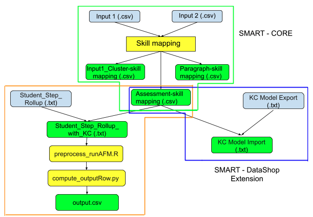

# SMART - CORE

## Overview
SMART - CORE is the core of the SMART application which generates skills for all the instructional texts.

## Table of Contents
  * [Overview](#overview)
  * [How does it work?](#how-does-it-work-)
    + [Inputs to SMART - CORE](#inputs-to-smart---core)
    + [Outputs of SMART - CORE](#outputs-of-smart---core)
  * [SMART - DataShop Extension:](#smart---datashop-extension-)
    + [Inputs to SMART - DataShop Extension](#inputs-to-smart---datashop-extension)
    + [Outputs of SMART- DataShop Extension](#outputs-of-smart--datashop-extension)

## How does it work?

In the fugure above, Input 1 = assessments.csv, and Input 2 = paragraphs.csv for the assessment strategy. Likewise, it is opposite for the paragraph strategy.

1. Inputs

    The inputs files are the instructional texts (assessments and paragraphs) parsed from the xml files of the OLI course data by [OLI_XML_Parser](../OLI_XML_Parser).

2. Preprocessing

    The texts are lower cased and redundant white spaces are stripped. Special characters, numbers are removed. Lemmatization is performed. The vectors are encoded into vectors

3. Skill mining

    K-means clustering is used to cluster related texts. These clusters are hypothesised to be the skills associated with the online course.

4. Skill labelling

    Keyword Extraction is performed using TextRank. These keywords are hypothesised to represent the name of the skill (cluster) that they represent.

5. Skill mapping

    Mapping of assessments to skills, paragraphs to skills, and assessments to paragraphs using cosine similarity

### Inputs to SMART-CORE
The input to the SMART - Core are the output files generated by the [parser](../OLI%20XML%20Parser/README.md):
- Assessments (assessments.csv)  
    This file contains two columns: a. Unit-id, b. Assessment-id; c. Assessment text

- Paragraphs (paragraphs.csv)  
    This file contains two columns: a. Unit-id, b. Paragraph-id, c. Paragraph text
Note: Column (a) is only used for fine-tuning for BERT encodings.

Note: The file path for the assessments.csv and paragraphs.csv files are hard-coded in SMART/run_smart.py, lines 23/24 for either the OLI Biology courseware or OLI General Chemistry I courseware. To change between these courses, uncomment the appropriate line and comment the other. An update to the code will also need to be made to apply SMART to any future courses.

- #### BERT fine-tuned model

    The BERT embedding computation requires the fine-tuned BERT model. Due to size limitation of data on GitHub repository, the fined-tuned BERT model is saved on Nerve's external drive at `SMART/bert fine-tuning/bert-base-uncased_intro_bio`. Copy the `bert-base-uncased_intro_bio` folder inside the code repository folder at `SMART_CORE/bert fine-tuning/' to use BERT embeddings.
    Also, install the PyTorch library version for your machine from https://pytorch.org/get-started/locally/

### Outputs of SMART-CORE
It generates three output files:

- Cluster-keyword mapping  
A .txt file named like `<strategyType>Clusters_skill_<k>_<clusteringType>_<encodingType>_<clusters>_<strategyType>.csv` (e.g., `assessmentClusters_skill_46_second_tfidf_50_assessment.csv`), where `k` is the no. of skills identified.
It contains a list of `<ID.><keyword><clustered texts>` where `ID` is a sequence number (1, 2, …), `keyword` is a skill name, and `clustered texts` are a concatenated cluster of texts, either assessments or paragraphs, based on the input strategy.

- Paragraph-skill mapping  
A .csv file named like `paragraph_skill_<clusteringType>_<encodingType>_<clusters>_<strategyType>.csv` (e.g., `paragraph_skill_second_tfidf_50_assessment.csv`) where `clusters` is the input no. of clusters. The file contains two columns:  
    - paragraph name 
    - the associated skill found

- <a name="Assessment-skill"></a>Assessment-skill mapping  
A .csv file named like assessment_skill_<clusteringType>_<encodingType>_<clusters>_<strategyType>.csv (e.g., assessment_skill_second_tfidf_50_assessment.csv) where <clusters> is the input no. of clusters.The file contains two columns:  
    - assessment name 
    - the associated skill found

## SMART-Model Fit:

Run the [`get_StudentStep_KC_Opportunity_withThreshold.py`](get_StudentStep_KC_Opportunity_withThreshold.py) file using the following command on the terminal:
```
python get_StudentStep_KC_Opportunity_withThreshold.py <Assessment-skill mapping>
```

In the above command, [Assessment-skill mapping](#Assessment-skill) is a mandatory argument


Run the [`preprocess_runAFM_RMSE_1fold.R`](model_fit/preprocess_runAFM_RMSE_1fold.R) file using the following command on the terminal:
```
Rscript model_fit/preprocess_runAFM_RMSE_1fold.R <StudentStep_KC_Opportunity_outFile>
```
In the above command, [StudentStep_KC_Opportunity_outFile](#StudentStep_KC_Opportunity_outFile) is a mandatory argument


Run the [`compute_outputRow.py`](compute_outputRow.py) file using the following command on the terminal:
```
python SMART_CORE/compute_outputRow.py <strategyType> <encodingType> <clusteringType> <clusters> -R_output output/temp_logs/R_stdout$$.txt <n_run>
```

### Inputs to SMART-Model Fit
- [Assessment-skill mapping](#Assessment-skill)
- DataShop_Student_Step_rollup (located in the `DataShop Export` folder on OneDrive)

Note: The file path for Student Step roll-up is hard-coded in SMART/SMART_CORE/sort_StudentStep.py, lines 12/13 and SMART/SMART_CORE/get_StudentStep_KC_Opportunity_withThreshold.py, lines 21/22 for either the OLI Biology courseware or OLI General Chemistry I courseware. To change between these courses, uncomment the appropriate line and comment the other. An update to the code will also need to be made to apply SMART to any future courses.

Note: A reference to the appropriate KC model used when exporting the Student Step roll-up must be updated to the value corresponding to the courseware/student response data. Uncomment or modify the value in SMART/SMART_CORE/get_StudentStep_KC_Opportunity_withThreshold.py, line 108/109 to switch between courses.

### Outputs of SMART-Model Fit
- DataShop_Student_Step_rollup with KCs and opportunity count: A .csv file named like `<[Assessment-skill mapping](#Assessment-skill)>_StudentStep_KC_Opportunity.csv` (e.g., `assessment_skill_second_tfidf_50_assessment_StudentStep_KC_Opportunity.csv`). This file is generated using two input files:
    - DataShop_Student_Step_rollup
    - [Assessment-skill mapping](#Assessment-skill)

    This output file is identical with the `DataShop_Student_Step_rollup` except one additional column KC(SMART), which contains skill name derived from [Assessment-skill mapping](#Assessment-skill) file by using column `<ProblemName>_<StepName>` as a key.

    The output file would be saved in the same folder as SMART - CORE output folder.

<!-- #### SMART study result
SMART study result contains the following 10 columns:
- #Iteration
- Strategy type
- Vectorization type
- Encoding type
- #KCs
- AIC
- BIC
- #Observations
- Log-likelihood, #parameters
- Completion time -->

## SMART-DataShop Extension:

Run the [`get_KCModel_import.py`](get_KCModel_import.py) file using the following command on the terminal:
```
python get_KCModel_import.py <Assessment-skill mapping>
```

In the above command, [Assessment-skill mapping](#Assessment-skill) is a mandatory argument

Note: The file path for the DataShop KC Model used by get_KCModel_import.py is hardcoded in the file. This assumes that you are creating a KC Model for the OLI
Biology course to compare with the Model1_clst100w_nm_nmfC10old-PV-models KC Model. If comparing with another KC Model or course, modify this file path as appropriate.


### Inputs to SMART-DataShop Extension
- [Assessment-skill mapping](#Assessment-skill)
- DataShop_KC_Model (located in the `DataShop Export` folder on OneDrive)

### Outputs of SMART-DataShop Extension
- SMART_KC_Model ready for import to DataShop for evaluation: A .csv file named like `[DataShop_KC_Model](#DataShop_KC_Model)<[Assessment-skill mapping](#Assessment-skill)>_StudentStep_KC_Opportunity.csv` (e.g., `Model1_clst100w_nm_nmfC10old-PV-models1_assessment_skill_first_tfidf_163_assessment.txt`). 

The output file would be saved in the SMART_CORE/DataShop_Import/<today_date> folder.

### Import KC Model to DataShop
**Step 1**: Edit the KC model file in Excel or other text-file/spreadsheet editor.
- If desired, update the name of the SMART generated KC Model by changing the generated column header for the model name (SMART_<date>) i.e. by replacing "SMART_<date>" with the desired name for your new model.

**Step 2**: Import a KC model file to DataShop
- Navigate to the dataset in DataShop.
- Click on the KC Models link for the dataset.
- Start the import process by clicking Import at the top of the KC Models page.
- Click Choose File to browse for the KC model file you edited.
- Click Verify to start file verification. If errors are found in your file, fix them and re-verify the file. When DataShop successfully verifies the file, you can then import it by clicking the Import button.

