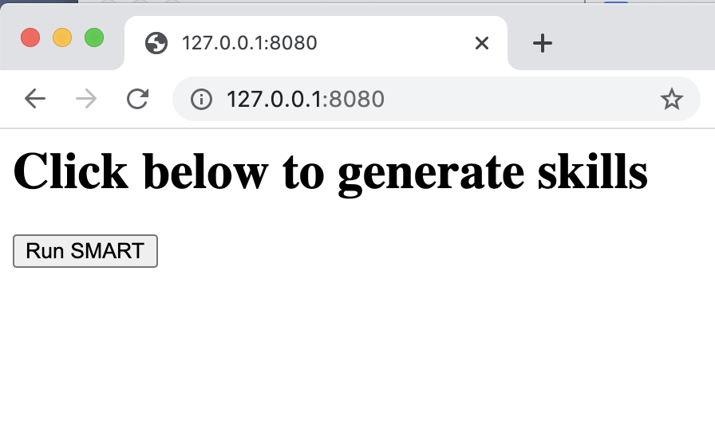

# SMART CyberBook Extension

## Table of Contents
  * [Overview](#overview)
  <!-- * [How to run?](#how-to-run-) -->
  * [How does it work?](#how-does-it-work-)
      - [1. Connect to the database server.](#1-connect-to-the-database-server)
      - [2. Fetch instructionalText ids and instructionalText texts.](#2-fetch-instructionaltext-ids-and-instructionaltext-texts)
      - [3. Run SMART_CORE.](#3-run-smart-core)
      - [4. Update database table with the skill names.](#4-update-database-table-with-the-skill-names)
      
## Overview

This is an extension of SMART_CORE. This allows SMART to be used as a service and invoked from CyberBook.

<!-- ## How to run?

This has been described in the parent README. -->

## How does it work?

Basically, the code in SMART_CyberBook wraps SMART_CORE with a Flask API to be used as a service. The `main()` function of the [`main.py`](./main.py) is invoked when the service is invoked. The main() function invokes the following tasks in sequential order:

 #### 1. Connect to the database server.
 This steps creates a connection to the database server using the `mysql.connector` python package. Currently, it connects to the `edxapp_csmh` database on the Mocha database server.

#### 2. Fetch instructionalText ids and instructionalText texts.
Currently, the data is fetched from the `export_course_content_and_skill_validation` table.
For ids, we fetch the `problem_name` column. For the texts, the `question`, `correct_answer`, and `hint` columns are fetched.

#### 3. Run SMART_CORE.
The fetched data is used as the input for SMART_CORE. After it is run, skill names are generated for all the text_ids.

#### 4. Update database table with the skill names.
The generated skill names are used to update the `skillname` column in the table.

We have used Docker to package SMART_CORE and its dependencies.

